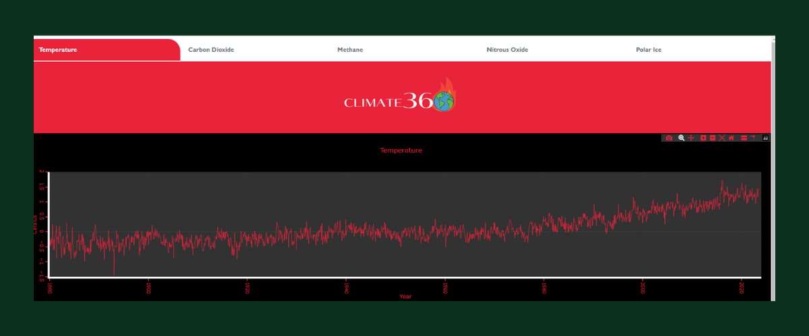

# Climate360

`Climate 360` is an application designed to bring global climate data right to your fingertips. It leverages the API from [Global Warming API](https://global-warming.org/) to fetch comprehensive data related to:
* global temperature
* carbon dioxide
* methane
* nitrus oxide
* polar ice

With `Climate 360` users can easily visualize and understand the current state and trends of our planet's climete, making it a valuable tool for educators, researchers, and anyone interested in climate science.

## Usage

The utilization process is straightforward. Simply navigate to the corresponding tab in the menu to access the relevant content.

## Dependencies

* This project was generated with [Angular CLI](https://github.com/angular/angular-cli) version 16.1.1.
* Angular Material
* [Plotly](https://plotly.com/javascript/) library for data visualization

## Install
Run `npm install` on your device for try the application.
## Development server

Run `ng serve` for a dev server. Navigate to `http://localhost:4200/`. The application will automatically reload if you change any of the source files.

## Build

Run `ng build` to build the project. The build artifacts will be stored in the `dist/` directory.

[Live Demo](https://climate360.netlify.app/)

